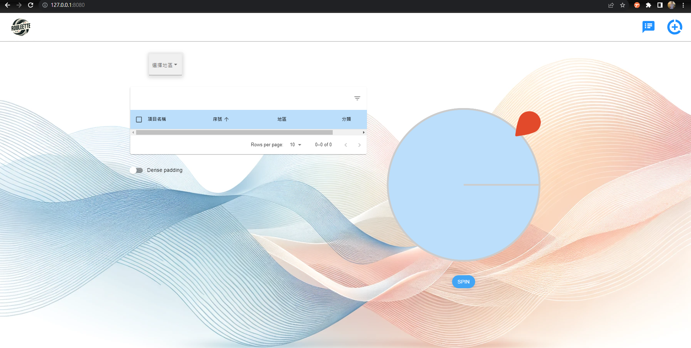

# 選擇障礙殺手 2.0

~~因開發者 CSS 功力尚待加強~~,使用時請使用**電腦**瀏覽器並以**全螢幕**開啟

本專案原始碼是由 Next.js 官方提供與 mongo 連接的[範例](https://github.com/vercel/next.js/tree/canary/examples/with-mongodb-mongoose)修改

## Intro:

**只有沒辦法選擇的人,沒有沒辦法決定的輪!**

午餐不知道喝甚麼? 沒關係 轉一下! :tada:  
飲料不知道喝甚麼? 沒關係 轉一下! :tada:  
點心不知道吃甚麼? 沒關係 轉一下! :tada:  
感情危機不知道怎麼辦? 沒關係 轉幾下 都沒用! :trollface:

### 特色介紹:

- [x] 可以自由新增項目, 只要依照地區以及類別即可顯示清單
- [x] 喝膩品項看不順眼? 直接勾選讓點選刪除讓他消失在生活中!
- [x] 找菜單很麻煩? 只要新增時有放入參考網址即可馬上連結店家資訊
- [x] 決定好還要通知心很累?一鍵點選輸入相關資訊,BOT 自動幫你發消息到 Telegram 通知開團!

## 如何運行本專案

#### Step.1：將專案複製至本機

```bash
# 透過 git clone 專案
git clone https://github.com/Dino-W/next-meal-decide-app.git
# 切換到專案根目錄
cd next-meal-decide-app
```

### 使用本機 Node.js 運行方式

> [!CAUTION]
> 使用這個方式環境須自備 Mongo DB 與 Node.js, 如果沒有的話安裝說明請參考:
>
> > [MongoDB](https://www.mongodb.com/docs/manual/installation/)安裝(依照系統需求安裝)  
> > [NodeJS](https://nodejs.org/en/download/)安裝(依照系統需求安裝,建議安裝 16.x 以上 LTS 版本)

#### Step.2：安裝專案所需 dependencies 並建置專案

```bash
# 安裝dependencies
npm install
```

設定環境變數(編輯.env 檔)  
MONGODB_URI = #MongoDB 連線字串,可以自己調整要用哪個 DB(沒有的話會自動創建一個)  
`如果只是單純需要輪盤不需要通知也可以不設定這兩個變數, 不要使用通知功能即可`  
TELEGRAM_TOKEN = #TG BOT TOKEN  
CHAT_ID = #通知對象或群組 ID

```bash
# 執行Build Process
npm run build
```

#### Step.3：使用 pm2 運行專案

```bash
# 全局安裝pm2
npm install pm2 -g
```

> [!Note]
> 本專案設定運行於 `8080` port, 如有需要自訂對應的 port 可以修改 package.json 裡面的"next start -p"後方數字

```bash
# pm2執行專案
pm2 start npm --name "[自訂pm2程序名稱]" -- run start
```

#### Step.4：請開始你的選擇！

開啟任一瀏覽器, 輸入`127.0.0.1:8080`,然後... :tada:  
成功運行會看到如下畫面:


<!-- ### docker-compose 版本

> [!CAUTION]
> 請確保環境有 docker engine, 並有安裝 docker-compose (Linux 需另外安裝)

```bash
# 在根目錄下執行以下指令
docker-compose up -d
``` -->

操作介面說明:

- **新增輪盤選項**：點選右上角 :heavy_plus_sign: 圖示，即可依照地區及分類新增內容
- **操作輪盤**：選擇完地區及分類之後會於輪盤顯示所有項目，按下"SPIN"按鈕等待幾秒會顯示結果於下方
- **刪除項目**：勾選欲刪除的項目之後，表格右上角圖示會變成 :milk_glass: 點選即可刪除
- **使用 BOT 傳送通知至 TG**：點選右上角 :speech_balloon: 圖示並填寫資訊即可自動幫你發送通知

  Have fun！ :tada:

> [!NOTE]
> 因目前資料結構相對簡易，暫時沒有提供資料修改的功能 ~~(絕對不是作者偷懶)~~，如果想要修改項目內容建議直接刪除並新增一筆即可
